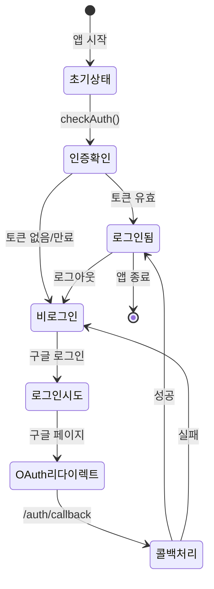
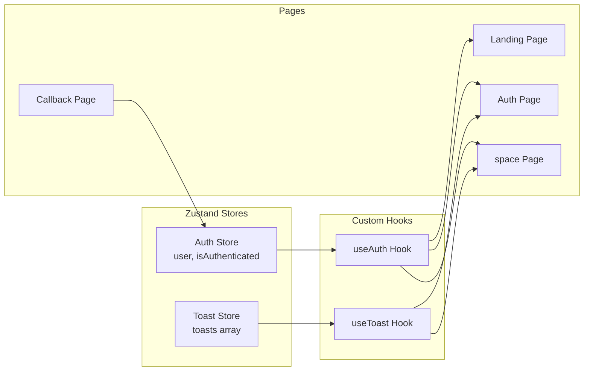
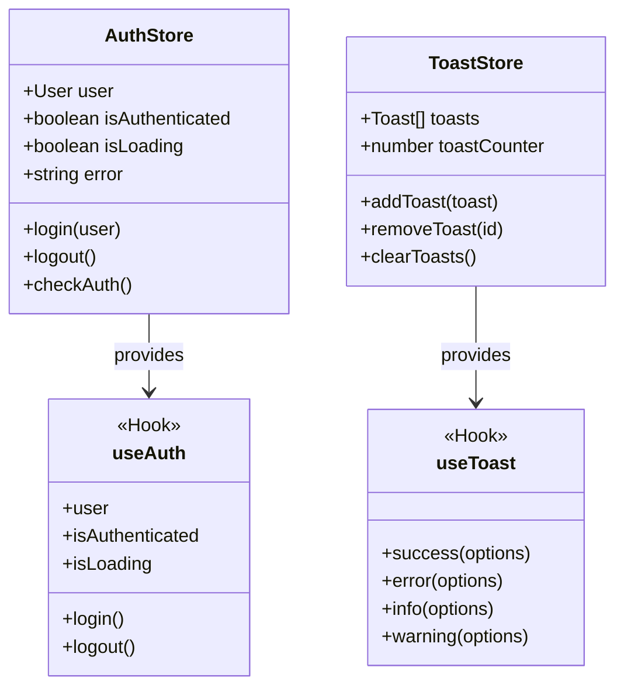
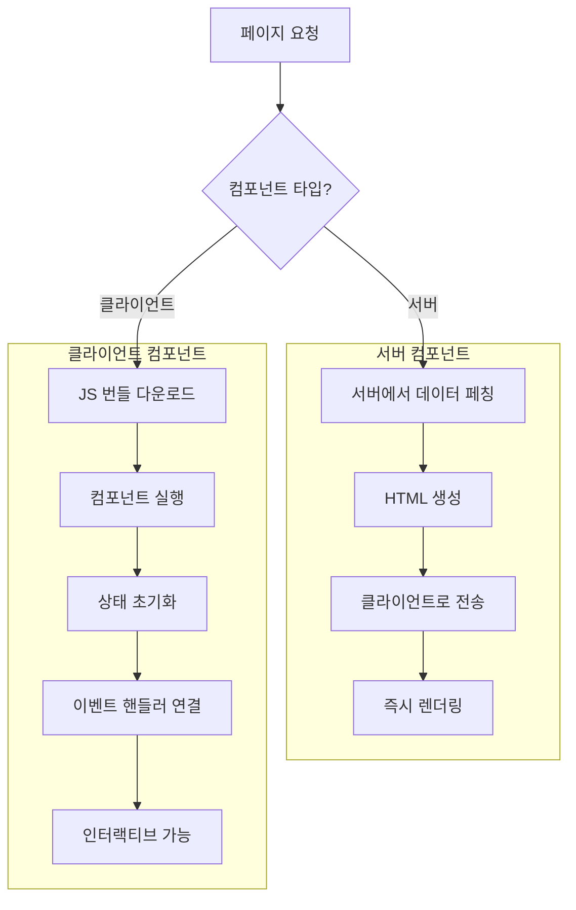
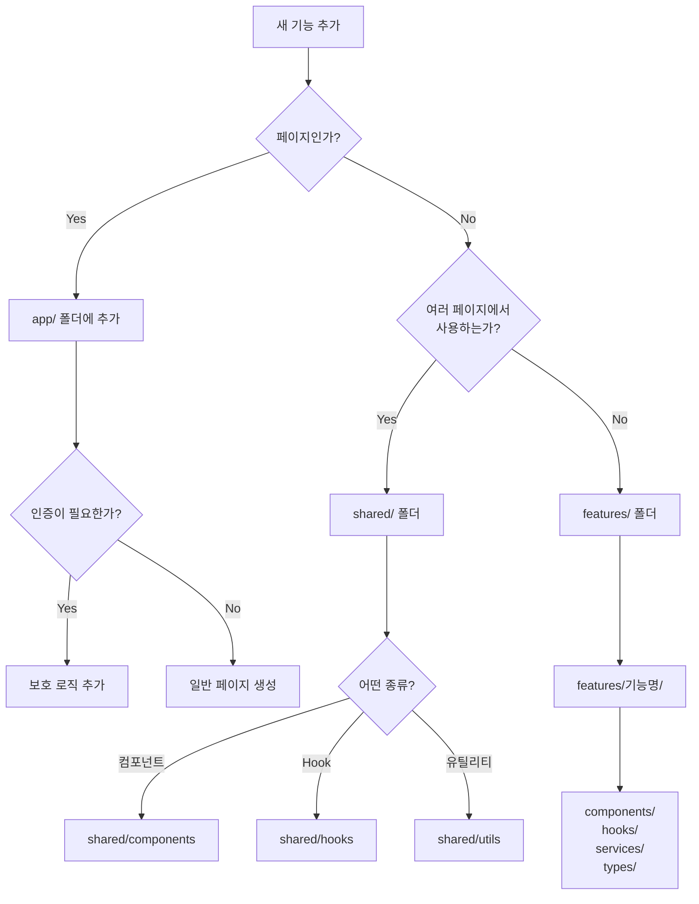
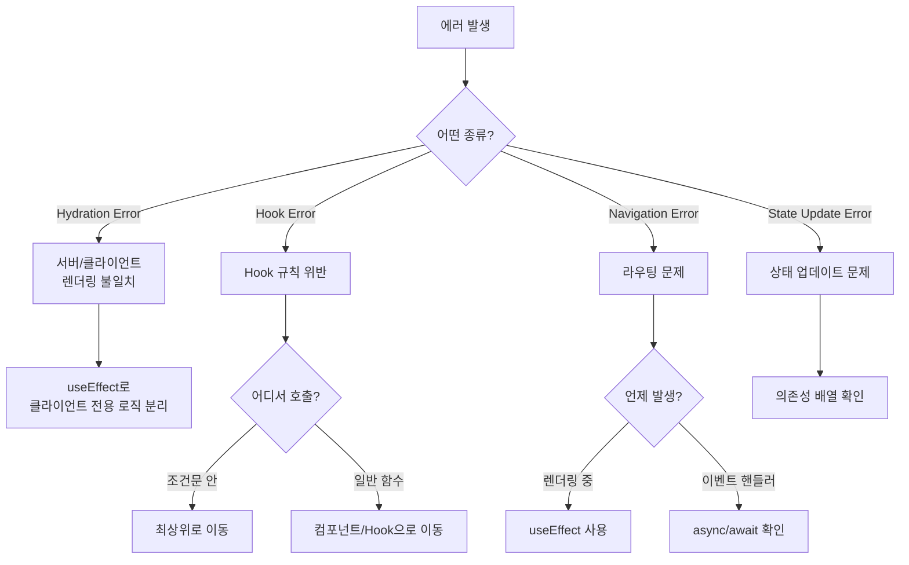
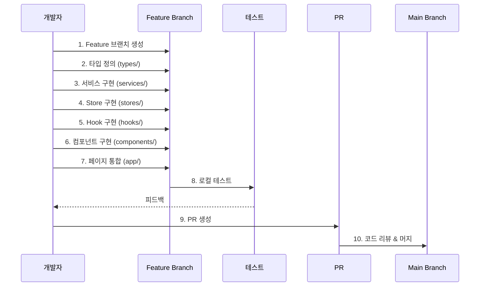
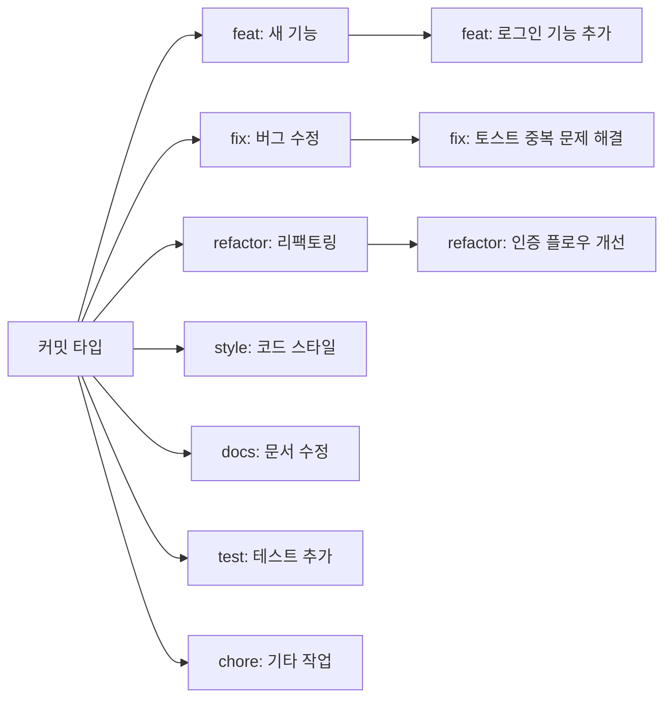

# Next.js 앱 라우터 가이드: Scrumble 인증 플로우로 배우기

이 문서는 React는 알지만 Next.js가 처음인 개발자를 위한 가이드입니다. Scrumble의 실제 인증 플로우를 통해 Next.js 15의 핵심 개념들을 설명합니다.

## 목차

1. [Next.js App Router 기본 개념](#1-nextjs-app-router-기본-개념)
2. [인증 플로우 전체 구조](#2-인증-플로우-전체-구조)
3. [페이지별 상세 분석](#3-페이지별-상세-분석)
4. [상태 관리: Zustand](#4-상태-관리-zustand)
5. [Hook 패턴과 활용](#5-hook-패턴과-활용)
6. [클라이언트 컴포넌트 vs 서버 컴포넌트](#6-클라이언트-컴포넌트-vs-서버-컴포넌트)
7. [개발 가이드라인](#7-개발-가이드라인)

---

## 1. Next.js App Router 기본 개념

### 폴더 기반 라우팅

Next.js 13+ App Router는 파일 시스템 기반 라우팅을 사용합니다:

```
src/app/
├── page.tsx              # / (홈 페이지)
├── layout.tsx            # 전체 레이아웃
├── auth/
│   ├── page.tsx         # /auth
│   └── callback/
│       └── page.tsx     # /auth/callback
└── space/
    └── create/
        └── page.tsx     # /space/create
```

### 특별한 파일들

- `page.tsx`: 라우트의 UI를 정의
- `layout.tsx`: 여러 페이지가 공유하는 UI
- `loading.tsx`: 로딩 UI (자동으로 Suspense 처리)
- `error.tsx`: 에러 바운더리
- `not-found.tsx`: 404 페이지

---

## 2. 인증 플로우 전체 구조

### 전체 흐름도

```mermaid
graph TD
    A[랜딩 페이지 /] --> B{로그인 상태?}
    B -->|No| C[/auth 리다이렉트]
    B -->|Yes| D[/space/create 리다이렉트]

    C --> E[구글 로그인 버튼 클릭]
    E --> F[구글 OAuth 페이지]
    F --> G[/auth/callback]
    G --> H[토큰 저장]
    H --> I[사용자 정보 저장]
    I --> J[/space/create?auth=success]
    J --> K[성공 토스트 표시]
```

### 상태 관리 플로우



### 주요 컴포넌트 관계도

```
app/layout.tsx (Root Layout)
├── ToastProvider (전역 토스트)
└── children
    ├── app/page.tsx (랜딩)
    ├── app/auth/page.tsx (로그인)
    ├── app/auth/callback/page.tsx (OAuth 콜백)
    └── app/space/create/page.tsx (워크스페이스 생성)
```

### 컴포넌트 간 데이터 흐름



---

## 3. 페이지별 상세 분석

### 3.1 Root Layout (`app/layout.tsx`)

```typescript
// app/layout.tsx
export default function RootLayout({
  children,
}: {
  children: React.ReactNode;
}) {
  return (
    <html lang="ko">
      <body className={getFontClassNames()} suppressHydrationWarning={true}>
        {children}
        <ToastProvider /> {/* 전역 토스트 프로바이더 */}
      </body>
    </html>
  );
}
```

**핵심 개념:**

- 모든 페이지에 적용되는 최상위 레이아웃
- 폰트, 전역 스타일, 프로바이더 설정
- `suppressHydrationWarning`: 서버/클라이언트 불일치 경고 방지

### 3.2 랜딩 페이지 (`app/page.tsx`)

```typescript
'use client'; // 클라이언트 컴포넌트 선언

export default function Home() {
  const router = useRouter(); // Next.js 라우터
  const { isAuthenticated, isLoading } = useAuth(); // 커스텀 훅

  useEffect(() => {
    if (!isLoading) {
      if (isAuthenticated) {
        router.push('/space/create');
      } else {
        router.push('/auth');
      }
    }
  }, [isAuthenticated, isLoading, router]);

  // 로딩 중 UI
  return <LoadingSpinner />;
}
```

**핵심 개념:**

- `'use client'`: 클라이언트 사이드에서만 실행
- `useRouter()`: 프로그래매틱 라우팅
- `useEffect()`: 사이드 이펙트 처리 (리다이렉트)

### 3.3 로그인 페이지 (`app/auth/page.tsx`)

```typescript
export default function AuthPageRoute() {
  const searchParams = useSearchParams(); // URL 파라미터 읽기
  const { error } = useToast();
  const hasShownToast = useRef(false); // 토스트 중복 방지

  useEffect(() => {
    const authStatus = searchParams.get('auth');
    const message = searchParams.get('message');

    if (hasShownToast.current) return; // 이미 표시했으면 종료

    if (authStatus === 'error') {
      hasShownToast.current = true;
      error({
        title: '로그인 실패',
        message: message ? decodeURIComponent(message) : '로그인 중 오류가 발생했습니다.',
      });

      // URL 파라미터 제거 (깔끔한 URL 유지)
      const url = new URL(window.location.href);
      url.searchParams.delete('auth');
      url.searchParams.delete('message');
      window.history.replaceState({}, '', url.toString());
    }
  }, [searchParams, error]);

  return <AuthPage />; // 실제 로그인 UI 컴포넌트
}
```

**핵심 개념:**

- `useSearchParams()`: URL 쿼리 파라미터 접근
- `useRef()`: 리렌더링 간 값 유지 (토스트 중복 방지)
- `window.history.replaceState()`: URL 변경 (새 기록 생성 X)

### 3.4 OAuth 콜백 페이지 (`app/auth/callback/page.tsx`)

```typescript
const AuthCallbackPage = () => {
  const router = useRouter();
  const searchParams = useSearchParams();
  const { login } = useAuthStore(); // Zustand store 액션

  useEffect(() => {
    const handleCallback = async () => {
      try {
        // URL에서 에러 확인
        const error = searchParams.get("error");
        if (error) {
          router.push(
            "/auth?auth=error&message=" +
              encodeURIComponent("로그인이 취소되었거나 오류가 발생했습니다.")
          );
          return;
        }

        // 토큰 파라미터 확인 (실제로는 백엔드에서 쿠키로 전달 권장)
        const accessToken = searchParams.get("access_token");
        const refreshToken = searchParams.get("refresh_token");

        if (accessToken && refreshToken) {
          // 토큰 저장
          tokenStorage.setTokens(accessToken, refreshToken);

          // 사용자 정보 생성
          const userData = {
            id: userId,
            email: decodeURIComponent(userEmail),
            name: decodeURIComponent(userName),
            avatarURL: "",
          };

          // 전역 상태에 로그인 정보 저장
          login(userData);

          // 성공 리다이렉트
          router.push("/space/create?auth=success");
        }
      } catch (error) {
        console.error("Auth callback error:", error);
        router.push(
          "/auth?auth=error&message=" +
            encodeURIComponent("로그인 처리 중 오류가 발생했습니다.")
        );
      }
    };

    handleCallback();
  }, [searchParams, router, login]); // 의존성 배열
};
```

**핵심 개념:**

- OAuth 플로우의 콜백 처리
- 토큰 저장 및 상태 업데이트
- 에러 처리 및 리다이렉트

### 3.5 워크스페이스 생성 페이지 (`app/space/create/page.tsx`)

```typescript
export default function CreateSpacePage() {
  const router = useRouter();
  const searchParams = useSearchParams();
  const { user, isAuthenticated, isLoading, logout } = useAuth();
  const { success, error } = useToast();
  const [spaceName, setspaceName] = useState("");
  const toastShownRef = useRef(false); // 토스트 중복 방지

  // 로그인 성공 토스트
  useEffect(() => {
    const authStatus = searchParams.get("auth");
    if (authStatus === "success" && !toastShownRef.current) {
      // URL 파라미터 제거
      const url = new URL(window.location.href);
      url.searchParams.delete("auth");
      window.history.replaceState({}, "", url.toString());

      // 토스트 한 번만 표시
      toastShownRef.current = true;
      success({
        title: "로그인 성공!",
        message: "워크스페이스를 생성하여 시작하세요.",
      });
    }
  }, [searchParams, success]);

  // 인증되지 않은 경우 리다이렉트
  useEffect(() => {
    if (!isLoading && !isAuthenticated) {
      router.push("/auth");
    }
  }, [isAuthenticated, isLoading, router]);

  // 폼 제출 처리
  const handleCreatespace = async (e: React.FormEvent) => {
    e.preventDefault();

    if (!spaceName.trim()) {
      error({
        title: "입력 오류",
        message: "워크스페이스 이름을 입력해주세요.",
      });
      return;
    }

    // API 호출 및 리다이렉트...
  };
}
```

**핵심 개념:**

- Protected Route: 인증 확인 후 접근
- 폼 상태 관리 및 제출 처리
- 로딩/에러 상태 처리

---

## 4. 상태 관리: Zustand

### Zustand 아키텍처



### 4.1 Zustand Store 구조

```typescript
// shared/stores/auth.store.ts
interface AuthState {
  // 상태
  user: User | null;
  isAuthenticated: boolean;
  isLoading: boolean;
  error: string | null;

  // 액션
  login: (user: User) => void;
  logout: () => Promise<void>;
  checkAuth: () => Promise<void>;
}

export const useAuthStore = create<AuthState>((set, get) => ({
  // 초기 상태
  user: null,
  isAuthenticated: false,
  isLoading: true,
  error: null,

  // 로그인 액션
  login: (user) => {
    set({
      user,
      isAuthenticated: true,
      error: null,
    });
    localStorage.setItem("user", JSON.stringify(user));
  },

  // 로그아웃 액션
  logout: async () => {
    try {
      set({ isLoading: true });

      // 토큰 제거
      tokenStorage.clearTokens();
      localStorage.removeItem("user");

      set({
        user: null,
        isAuthenticated: false,
        isLoading: false,
      });
    } catch (error) {
      console.error("Logout error:", error);
    }
  },
}));
```

**Zustand 핵심 개념:**

- `create()`: 스토어 생성
- `set()`: 상태 업데이트
- `get()`: 현재 상태 읽기
- 액션 = 상태를 변경하는 함수

### 4.2 Hook으로 감싸기

```typescript
// shared/hooks/useAuth.ts
export function useAuth() {
  const {
    user,
    isAuthenticated,
    isLoading,
    isInitialized,
    error,
    login,
    logout,
    checkAuth,
    setError,
    clearError,
  } = useAuthStore();

  // 초기 인증 체크
  useEffect(() => {
    if (!isInitialized) {
      checkAuth();
    }
  }, [isInitialized, checkAuth]);

  return {
    user,
    isAuthenticated,
    isLoading,
    isInitialized,
    error,
    login,
    logout,
    checkAuth,
    setError,
    clearError,
  };
}
```

**Hook 패턴의 장점:**

- 추가 로직 캡슐화
- 초기화 로직 중앙화
- 테스트 용이성

---

## 5. Hook 패턴과 활용

### 5.1 커스텀 Hook 예시: useToast

```typescript
// shared/hooks/useToast.ts
export function useToast() {
  const { addToast, removeToast, clearToasts } = useToastStore();

  // 각 타입별 헬퍼 함수
  const success = useCallback(
    (options: ToastOptions) => {
      addToast({
        type: "success",
        title: options.title,
        message: options.message,
        duration: options.duration,
      });
    },
    [addToast]
  );

  const error = useCallback(
    (options: ToastOptions) => {
      addToast({
        type: "error",
        title: options.title,
        message: options.message,
        duration: options.duration,
      });
    },
    [addToast]
  );

  return {
    success,
    error,
    info,
    warning,
    dismiss: removeToast,
    dismissAll: clearToasts,
  };
}
```

**사용 예시:**

```typescript
const { success, error } = useToast();

// 성공 메시지
success({
  title: "저장 완료!",
  message: "변경사항이 저장되었습니다.",
});

// 에러 메시지
error({
  title: "오류 발생",
  message: "다시 시도해주세요.",
});
```

### 5.2 Hook 규칙

1. **이름은 `use`로 시작**: `useAuth`, `useToast`
2. **최상위에서만 호출**: 조건문, 반복문 안에서 X
3. **React 함수 컴포넌트에서만 호출**
4. **커스텀 Hook 안에서 다른 Hook 호출 가능**

---

## 6. 클라이언트 컴포넌트 vs 서버 컴포넌트

### 렌더링 플로우 비교



### 6.1 서버 컴포넌트 (기본값)

```typescript
// 'use client' 지시문이 없으면 서버 컴포넌트
export default function ServerComponent() {
  // ❌ useState, useEffect 사용 불가
  // ❌ 이벤트 핸들러 사용 불가
  // ✅ async/await 직접 사용 가능
  // ✅ 서버 리소스 직접 접근 가능

  return <div>서버에서 렌더링됨</div>;
}
```

### 6.2 클라이언트 컴포넌트

```typescript
'use client'; // 필수!

export default function ClientComponent() {
  // ✅ useState, useEffect 사용 가능
  // ✅ 이벤트 핸들러 사용 가능
  // ✅ 브라우저 API 사용 가능
  // ❌ async 컴포넌트 불가

  const [count, setCount] = useState(0);

  return (
    <button onClick={() => setCount(count + 1)}>
      클릭: {count}
    </button>
  );
}
```

### 6.3 언제 무엇을 사용할까?

**서버 컴포넌트 사용:**

- 데이터 페칭
- 백엔드 리소스 접근
- 민감한 정보 처리
- 정적 콘텐츠

**클라이언트 컴포넌트 사용:**

- 상호작용 (onClick, onChange)
- 상태 관리 (useState, useReducer)
- 브라우저 API (localStorage, window)
- 실시간 업데이트

---

## 7. 개발 가이드라인

### Next.js 라우팅 결정 트리



### 7.1 폴더 구조 가이드

```
src/
├── app/                    # 라우트 페이지
│   └── (기능)/
│       └── page.tsx
├── features/              # 기능별 모듈
│   └── (기능)/
│       ├── components/    # 해당 기능 전용 컴포넌트
│       ├── hooks/        # 해당 기능 전용 훅
│       ├── services/     # API 호출
│       └── types/        # 타입 정의
└── shared/               # 공통 모듈
    ├── components/       # 재사용 컴포넌트
    ├── hooks/           # 공통 훅
    ├── stores/          # 전역 상태
    └── lib/             # 유틸리티
```

### 7.2 컴포넌트 작성 패턴

```typescript
// features/checkin/components/CheckinCard.tsx
'use client';

interface CheckinCardProps {
  checkin: Checkin;
  onReaction: (emoji: string) => void;
  isLoading?: boolean;
}

export function CheckinCard({
  checkin,
  onReaction,
  isLoading = false
}: CheckinCardProps) {
  // 1. Hooks는 최상단
  const [isExpanded, setIsExpanded] = useState(false);
  const { user } = useAuth();

  // 2. 조건부 렌더링은 early return
  if (isLoading) {
    return <CheckinCardSkeleton />;
  }

  // 3. 이벤트 핸들러
  const handleReactionClick = (emoji: string) => {
    if (!user) return;
    onReaction(emoji);
  };

  // 4. 메인 렌더링
  return (
    <Card className="p-4">
      {/* 컴포넌트 내용 */}
    </Card>
  );
}
```

### 7.3 API 호출 패턴

```typescript
// features/space/services/space.service.ts
class spaceService {
  async create(data: CreatespaceDto): Promise<space> {
    try {
      const response = await api.post("/spaces", data);
      return response.data;
    } catch (error) {
      throw new Error("워크스페이스 생성 실패");
    }
  }

  async getById(id: string): Promise<space> {
    const response = await api.get(`/spaces/${id}`);
    return response.data;
  }
}

export const spaceService = new spaceService();
```

### 7.4 페이지 보호 패턴

```typescript
// Protected Page Component
'use client';

export default function ProtectedPage() {
  const router = useRouter();
  const { isAuthenticated, isLoading } = useAuth();

  useEffect(() => {
    if (!isLoading && !isAuthenticated) {
      router.push('/auth');
    }
  }, [isAuthenticated, isLoading, router]);

  if (isLoading) {
    return <LoadingScreen />;
  }

  if (!isAuthenticated) {
    return null; // 리다이렉트 중
  }

  return <div>보호된 콘텐츠</div>;
}
```

### 7.5 에러 처리 패턴

```typescript
// 컴포넌트에서 에러 처리
const handleSubmit = async () => {
  try {
    setIsLoading(true);
    await someApiCall();
    success({ title: "성공!" });
    router.push("/next-page");
  } catch (error) {
    console.error("Error:", error);
    error({
      title: "오류 발생",
      message: error.message || "다시 시도해주세요.",
    });
  } finally {
    setIsLoading(false);
  }
};
```

### 7.6 타입 안전성

```typescript
// types/space.ts
export interface space {
  id: string;
  name: string;
  createdAt: Date;
  members: Member[];
}

export interface CreatespaceDto {
  name: string;
  description?: string;
}

// 사용
const space: space = {
  id: "123",
  name: "우리 팀",
  createdAt: new Date(),
  members: [],
};
```

---

## 8. 실전 체크리스트

### 새 페이지 추가할 때

- [ ] `app/` 폴더에 적절한 경로 생성
- [ ] `page.tsx` 파일 생성
- [ ] 클라이언트 컴포넌트면 `'use client'` 추가
- [ ] 인증이 필요하면 보호 로직 추가
- [ ] 로딩/에러 상태 처리
- [ ] SEO가 필요하면 메타데이터 추가

### 새 기능 추가할 때

- [ ] `features/` 폴더에 기능 폴더 생성
- [ ] 필요한 하위 폴더 구조 생성
- [ ] 타입 정의부터 시작
- [ ] 서비스 레이어 구현
- [ ] 컴포넌트 구현
- [ ] 필요시 전역 상태 추가

### 상태 관리가 필요할 때

- [ ] 로컬 상태로 충분한지 확인 (useState)
- [ ] 여러 컴포넌트에서 필요하면 Zustand store 생성
- [ ] Hook으로 감싸서 제공
- [ ] 초기화 로직 고려

---

## 9. 자주 하는 실수와 해결법

### 트러블슈팅 플로우차트



### 1. Hydration 에러

**문제:**

```
Error: Hydration failed because the initial UI does not match what was rendered on the server.
```

**해결:**

```typescript
// ❌ 잘못된 예
<div>{new Date().toLocaleString()}</div>

// ✅ 올바른 예
const [mounted, setMounted] = useState(false);
useEffect(() => setMounted(true), []);

<div>{mounted ? new Date().toLocaleString() : 'Loading...'}</div>
```

### 2. useEffect 무한 루프

**문제:**

```typescript
// ❌ 무한 루프
useEffect(() => {
  setData({ ...data, updated: true });
}, [data]); // data가 변경되면 다시 실행
```

**해결:**

```typescript
// ✅ 올바른 예
useEffect(() => {
  setData((prev) => ({ ...prev, updated: true }));
}, []); // 한 번만 실행
```

### 3. 비동기 처리 누락

**문제:**

```typescript
// ❌ 에러 처리 없음
const handleClick = async () => {
  await apiCall();
  router.push("/next");
};
```

**해결:**

```typescript
// ✅ 올바른 예
const handleClick = async () => {
  try {
    setLoading(true);
    await apiCall();
    router.push("/next");
  } catch (error) {
    showError("실패했습니다");
  } finally {
    setLoading(false);
  }
};
```

---

## 10. 개발 워크플로우

### 기능 개발 프로세스



### Git 커밋 메시지 규칙



---

## 마무리

이 가이드는 Scrumble의 실제 코드를 바탕으로 Next.js의 핵심 개념들을 설명했습니다. 실제 개발 시 이 패턴들을 참고하여 일관성 있는 코드를 작성하시기 바랍니다.

추가 학습 자료:

- [Next.js 공식 문서](https://nextjs.org/docs)
- [Zustand 공식 문서](https://github.com/pmndrs/zustand)
- [React Hook 공식 문서](https://react.dev/reference/react)

질문이나 개선사항이 있다면 팀 채널로 공유해주세요! 🚀
