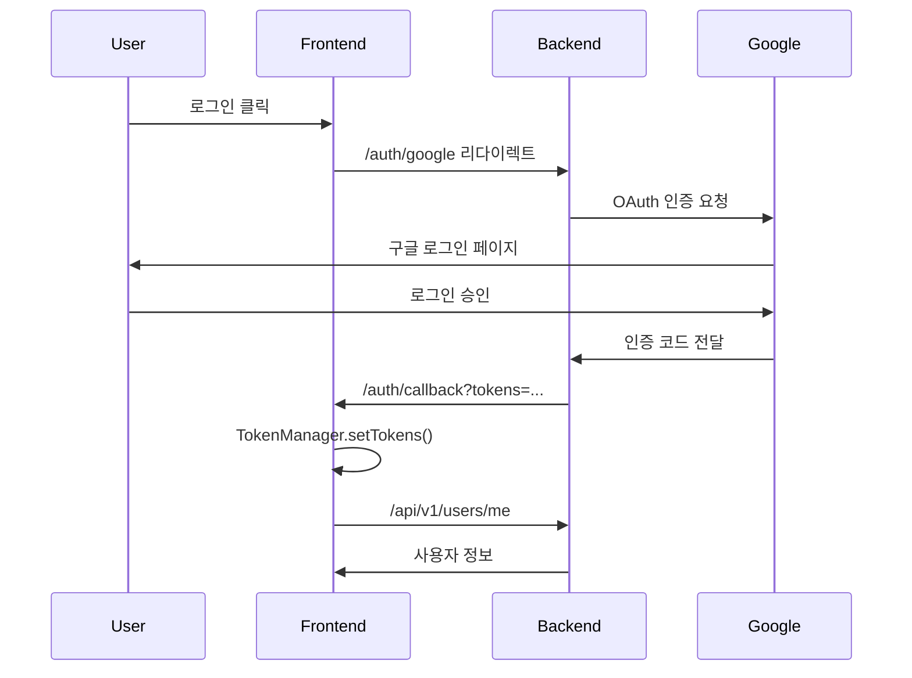
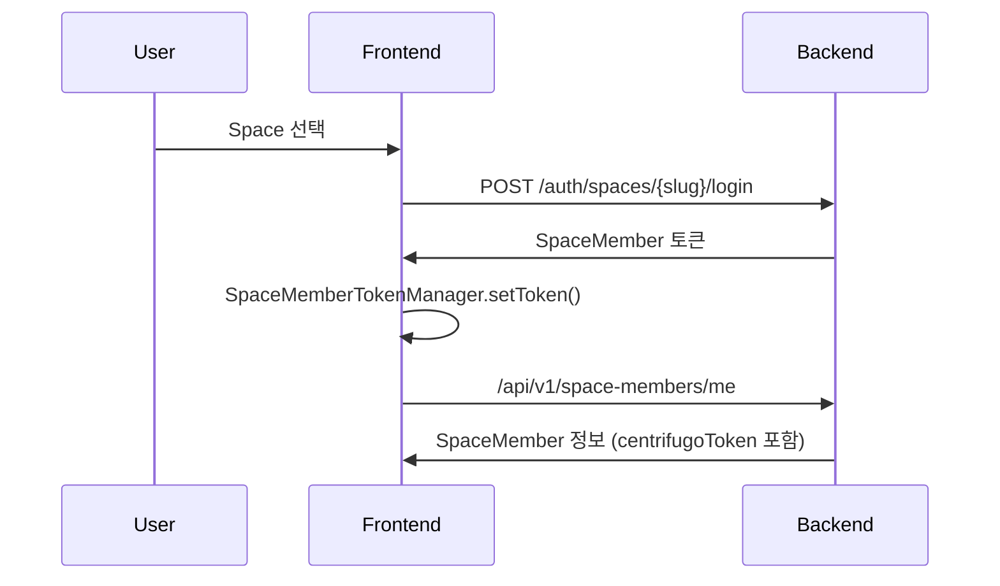
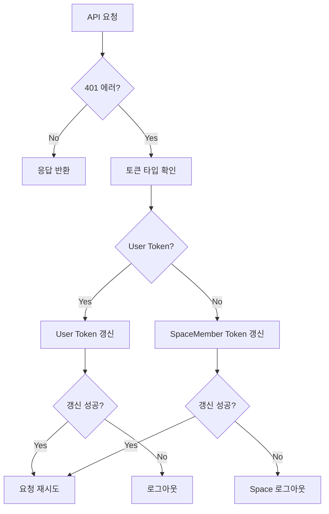

# 인증 시스템 아키텍처 문서

## 개요

Scrumble의 인증 시스템은 두 가지 레벨의 토큰을 관리합니다:
1. **User Token**: 사용자 인증용 (Google OAuth 기반)
2. **SpaceMember Token**: 특정 Space 접근용

## 토큰 관리 구조

### 1. Token Manager 계층 구조

```
BaseTokenManager (추상 클래스)
├── UserTokenManager (싱글톤)
└── SpaceMemberTokenManager (멀티 인스턴스)
```

### 2. 주요 인터페이스

```typescript
// 기본 토큰 관리 인터페이스
interface ITokenManager<T extends TokenPair> {
  setTokens(tokens: T): void;
  getAccessToken(): string | null;
  getRefreshToken(): string | null;
  clearTokens(): void;
  isAccessTokenValid(): boolean;
  isRefreshTokenValid(): boolean;
  shouldRefreshToken(): boolean;
  getAccessTokenTimeLeft(): number;
  decodeToken(token: string): DecodedToken | null;
}
```

## 인증 흐름

### 1. 초기 로그인 (Google OAuth)



### 2. Space 접근



### 3. 토큰 자동 갱신

#### User Token 자동 갱신
- 만료 1분 전 자동 갱신
- `useAutoRefreshToken` 훅이 관리
- 페이지 포커스/가시성 변경 시 체크

#### SpaceMember Token 자동 갱신
- 만료 5분 전 자동 갱신
- `useAutoRefreshSpaceMemberToken` 훅이 관리
- Space별로 독립적으로 관리

### 4. API 인터셉터 토큰 갱신



## 토큰 저장 구조

### User Token (localStorage)
```
accessToken: "eyJ..."
refreshToken: "eyJ..."
accessTokenExpiry: "1234567890"
refreshTokenExpiry: "1234567890"
```

### SpaceMember Tokens (localStorage)
```json
space_member_tokens: {
  "space-slug-1": {
    "accessToken": "eyJ...",
    "refreshToken": "eyJ..."
  },
  "space-slug-2": {
    "accessToken": "eyJ...",
    "refreshToken": "eyJ..."
  }
}
current_space_slug: "space-slug-1"
```

## API 엔드포인트별 토큰 사용

### User Token 사용 엔드포인트
- `/api/v1/users/*` - 사용자 정보
- `/api/v1/spaces/*` - Space 관리
- `/auth/refresh` - User 토큰 갱신
- `/auth/logout` - 전체 로그아웃
- `/auth/spaces/{slug}/login` - Space 로그인

### SpaceMember Token 사용 엔드포인트
- `/api/v1/space-members/*` - SpaceMember 정보
- `/api/v1/checkins/*` - 체크인 관련
- `/api/v1/posts/*` - 포스트 관련
- `/api/v1/comments/*` - 댓글 관련
- `/api/v1/reactions/*` - 리액션 관련
- `/auth/space-member/refresh` - SpaceMember 토큰 갱신
- `/auth/space-member/logout` - Space 로그아웃

## AuthContext 역할

`AuthContext`는 전체 인증 상태를 관리합니다:

1. **상태 관리**
   - `user`: 현재 로그인한 사용자
   - `currentSpaceMember`: 현재 Space의 멤버 정보
   - `availableSpaces`: 접근 가능한 Space 목록
   - `currentSpaceSlug`: 현재 선택된 Space

2. **주요 메서드**
   - `logout()`: 전체 로그아웃
   - `logoutFromSpace()`: 특정 Space에서만 로그아웃
   - `switchSpace()`: Space 전환
   - `setAuthData()`: OAuth 콜백 후 토큰 설정
   - `setSpaceAuthData()`: Space 인증 정보 설정

## 토큰 갱신 전략

### 1. 사전 갱신 (Proactive Refresh)
- **User Token**: 만료 1분 전
- **SpaceMember Token**: 만료 5분 전
- 백그라운드에서 자동으로 실행

### 2. 반응형 갱신 (Reactive Refresh)
- API 호출 시 401 에러 발생 시
- 인터셉터에서 자동으로 처리
- 대기열 방식으로 중복 갱신 방지

### 3. 조건부 갱신
- 페이지 포커스 시
- 문서 가시성 변경 시
- SpaceMember 쿼리 실행 전 체크

## 에러 처리

### User Token 에러
- 갱신 실패 시 전체 로그아웃
- `/auth` 페이지로 리다이렉트
- 모든 토큰 및 캐시 삭제

### SpaceMember Token 에러
- 갱신 실패 시 해당 Space만 로그아웃
- 다른 Space로 자동 전환 시도
- `spaceMemberTokenExpired` 이벤트 발생

## 보안 고려사항

1. **토큰 저장**
   - localStorage 사용 (XSS 취약점 주의)
   - 민감한 정보는 토큰에 포함하지 않음

2. **토큰 만료**
   - Access Token: 짧은 수명 (일반적으로 15-30분)
   - Refresh Token: 긴 수명 (일반적으로 7-30일)

3. **HTTPS 필수**
   - 모든 API 통신은 HTTPS로만
   - 토큰은 Authorization 헤더로만 전송

## 개발 가이드

### 새로운 API 엔드포인트 추가 시
1. 토큰 타입 결정 (User or SpaceMember)
2. `tokenRefreshHandler.ts`의 `determineTokenType` 함수 업데이트
3. 필요시 에러 코드 매핑 추가

### 새로운 Space 기능 추가 시
1. SpaceMember 토큰 사용 확인
2. Space 전환 시 상태 초기화 로직 추가
3. 필요시 Space별 캐시 무효화 추가

### 디버깅 팁
1. `debug` 유틸 활용: `debug('Auth', 'message')`
2. 브라우저 개발자 도구에서 localStorage 확인
3. Network 탭에서 Authorization 헤더 확인
4. 토큰 디코드: https://jwt.io/