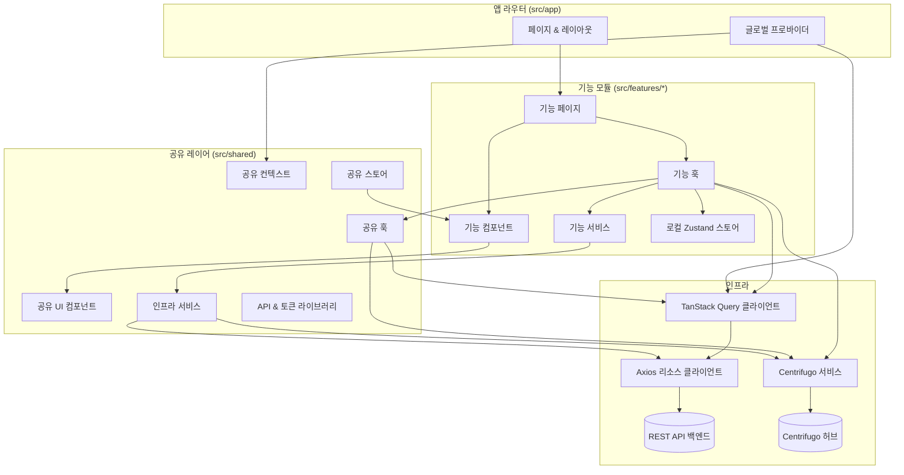

# Scrumble 프론트엔드 하이레벨 아키텍처

### 개요

- Next.js 15 App Router가 라우팅·레이아웃·서버/클라이언트 컴포넌트 경계를 주도하며 `src/app/providers.tsx`에서 전역 프로바이더를 묶어 관리합니다.
- 페이지 컴포넌트는 표시와 상호작용에 집중하고, 데이터 조회·변경·실시간 동기화는 전용 훅에 위임해 화면을 얇게 유지합니다.
- 제품 기능은 `src/features/*` 도메인 패키지 안에서 UI·훅·서비스·로컬 Zustand 스토어를 수직 슬라이스 구조로 함께 구성합니다.
- `src/shared`에는 모든 기능이 공유하는 UI, 컨텍스트, 서비스, 유틸리티가 모여 있어 도메인 모듈이 핵심 로직에만 집중할 수 있습니다.

### 애플리케이션 셸 (`src/app`)

- App Router 디렉터리(`page.tsx`, `layout.tsx`, `loading.tsx` 등)가 라우트 표면, 지연 로딩, 메타데이터를 정의합니다.
- `providers.tsx`는 `QueryClientProvider`, 인증/시간대/글로벌 로딩 컨텍스트를 합쳐 전역 훅에서 동일한 쿼리 클라이언트를 사용하도록 등록합니다.
- `spaces`, `auth`, 동적 세그먼트(`[spaceSlug]`) 같은 라우트 그룹이 기능 도메인과 1:1로 매핑되며, 말단 페이지는 보통 `src/features/**/pages` 진입점을 호출해 로직을 위임합니다.
- `src/app/api/*`의 API 라우트는 필요한 경우 서버 사이드 브리지로 백엔드와 통신합니다.

### 기능 모듈 (`src/features/*`)

- `components`, `pages`, `hooks`, `services`, `stores`, `types`, `utils`, `data`를 묶은 수직 슬라이스 레이아웃을 따르며, 도메인별 UI와 로직을 한곳에 둡니다.
- 기능 페이지는 공유 레이아웃 컴포넌트와 도메인 컴포넌트를 조합하는 얇은 래퍼 역할을 수행합니다.
- 훅은 조회/변경 로직과 부수효과를 감싸며, `src/shared/hooks/queries`의 TanStack Query 헬퍼와 도메인 서비스들을 가져와 사용합니다.
- 로컬 Zustand 스토어(`stores`)는 외부로 새지 않는 일시적 UI 상태를 보관합니다.
- 기능 서비스는 공유 API 클라이언트를 가져와 도메인별 포매팅, 낙관적 업데이트, 파생 모델을 구현합니다.

### 공유 레이어 (`src/shared`)

- `components`: Tailwind와 class-variance-authority 기반 디자인 시스템 컴포넌트(피드백, 내비게이션, 입력 등).
- `hooks`: 재사용 가능한 쿼리 훅(`queries/*`), 인증 도우미, 실시간 구독 훅으로 데이터 패칭/상태 오케스트레이션을 숨깁니다.
- `services`: `centrifugo.service.ts` 같은 인프라 서비스, 파일 업로드 도우미, 분석 로거 등 공통 기능을 제공합니다.
- `contexts`: 애플리케이션 셸이 사용하는 인증·시간대·전역 로딩 컨텍스트를 제공합니다.
- `stores`: 인증 상태, 토스트, 시간 유틸리티 등을 위한 전역 Zustand 스토어입니다.
- `lib`: 리소스별 Axios API 클라이언트, 토큰 매니저, 폰트, API 헬퍼 등 저수준 통합을 담당합니다.
- `types`와 `schemas`: 기능과 API 계층에서 공유하는 타입 정의와 검증 스키마 조각입니다.
- `utils`: 포매팅, 에러 처리, 범용 헬퍼를 제공합니다.

### 데이터 및 상태 흐름

- `src/shared/lib/api/*.ts`의 Axios 클라이언트가 백엔드 REST 엔드포인트를 감싸고, 기본 URL·인터셉터·토큰 갱신 로직을 중앙 집중화합니다.
- `src/shared/hooks/queries`의 쿼리/뮤테이션 훅은 TanStack Query 키와 캐싱 정책을 표준화하여 기능 모듈이 안전하게 조합할 수 있게 합니다.
- 전역 상태는 `shared/stores`의 경량 Zustand 스토어에, 기능별 상태는 해당 기능 폴더 안의 로컬 스토어에 유지합니다.
- 폼은 주로 기능 모듈 내부에서 React Hook Form과 Zod를 사용하며, 필요한 경우 공유 Resolver 유틸을 참조합니다.

### 실시간 동기화

- `CentrifugoService`는 단일 Centrifuge 클라이언트를 유지하며 재연결, 채널 영속화, 이벤트 디스패치를 관리합니다.
- 실시간 훅은 새 소켓을 열지 않고 공유 Centrifugo 레이어를 확장해 모든 기능이 동일한 연결과 이벤트 버스를 재사용합니다.
- 이벤트 수신 시 훅이 TanStack Query 캐시나 로컬 스토어를 갱신해 추가 리페치 없이 UI를 동기화합니다.

### UI 구성과 스타일링

- Tailwind CSS와 PostCSS가 스타일링 기반이며, class-variance-authority와 tailwind-merge로 컴포넌트 변형 클래스를 안정적으로 조합합니다.
- 프레이머 모션은 애니메이션과 마이크로 인터랙션을, 아이콘/이모지는 Lucide·Remix Icons·Emoji Mart와 같은 공유 라이브러리를 사용합니다.
- 반응형 동작과 가상 스크롤(React Window)은 재사용 컴포넌트로 제공되어 페이지 수준 코드가 선언적 구조를 유지합니다.

### 테스트와 개발 경험

- Jest + React Testing Library가 훅/컴포넌트 단위 동작을, Playwright가 E2E 회귀 시나리오를 검증합니다.
- TypeScript 엄격 모드, ESLint, `npm run build`(Next.js + SWC/Turbopack)를 통해 커밋 전 타입·린트 안정성을 확보합니다.
- `shared/utils/debug`, 토큰 매니저 등 공용 도구가 환경 전반에서 일관된 디버깅과 저장 전략을 제공합니다.

### 하이레벨 모듈 상호작용

